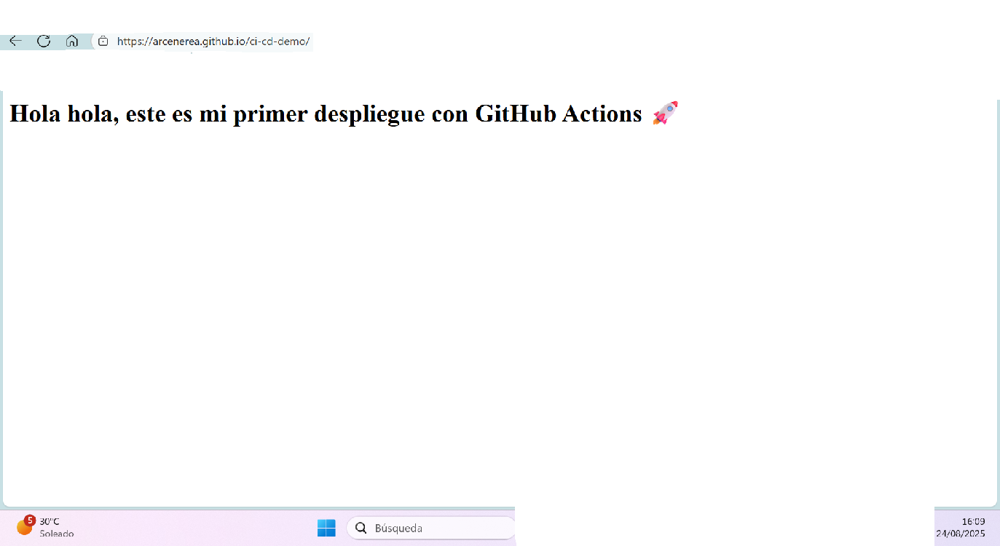

# CI-CD Demo

Proyecto de ejemplo de **DevOps / GitHub Actions** que publica automáticamente una web estática en GitHub Pages.

## Descripción

Este proyecto demuestra:

- Automatización con **GitHub Actions**.
- Despliegue continuo (**CI/CD**) a GitHub Pages.
- Gestión de repositorio y control de versiones.
- Publicación de un sitio web estático (`index.html`) accesible públicamente.

## Captura de pantalla

## URL del proyecto

[Ver página online](https://arcenerea.github.io/ci-cd-demo/)

## Tecnologías usadas

- **GitHub Actions**: automatización y despliegue.
- **GitHub Pages**: hosting gratuito para sitios estáticos.
- **HTML**: contenido del sitio web.
